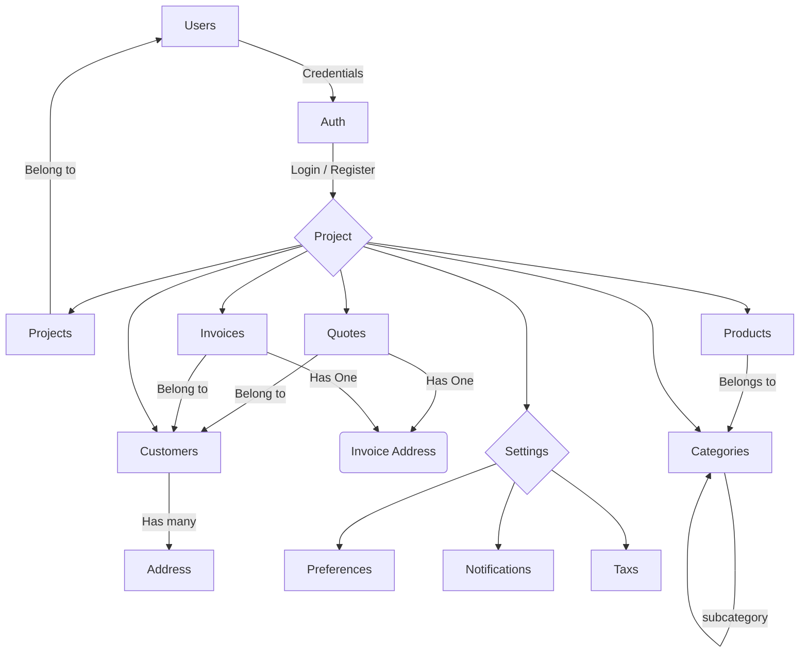

# Invoices

Invoices - #1 Phoenix Invoicing SAAS




To start Phoenix server:

- Install dependencies with `mix deps.get`
- Create and migrate your database with `mix ecto.setup`
- Start Phoenix endpoint with `mix phx.server` or inside IEx with `iex -S mix phx.server`

Now you can visit [`localhost:4000`](http://localhost:4000) from your browser.

## Enable S3 Storage

Copy the env example and modify values

```
cp .env.example .env
```

Run command to apply the env vars

```
source .env
```

Run the Phoenix server

```
mix phx.server
```

## Docs

- Docs: https://hexdocs.pm/phoenix
